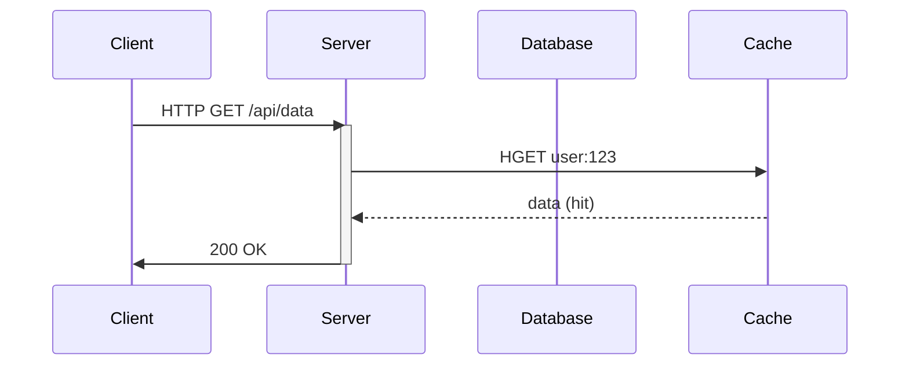
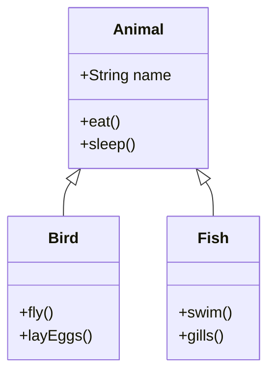
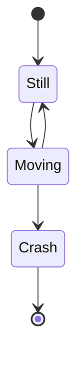
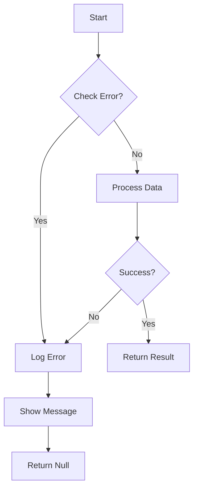
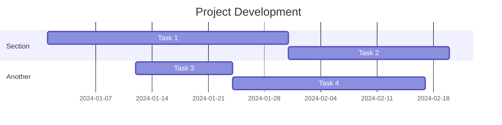
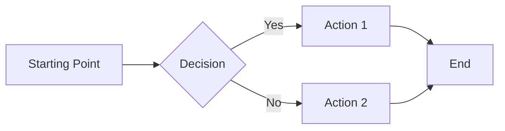
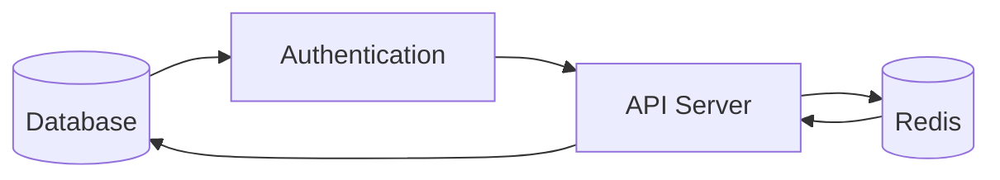

# 複雑な Mermaid 図テスト

## シーケンス図

## クラス図

## 状態図

## エラーハンドリングの例

## ganttチャート（beautiful-mermaid非対応）

## テキスト本文

これは mermaid 図の間に挟まれた通常のテキストです。

- ポイント1
- ポイント2
- ポイント3

`インラインコード` も含められます。

**太字** と *斜体* も問題ありません。

## flowchart LR のテスト

